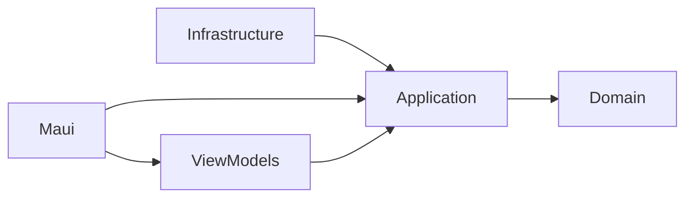

# OctoType

Do you want to learn dactylo ? Or improve your typing speed ?  
OctoType have been design in this very way  
Select you exercice, type then look at your stats.  

---
## Exercices

You can design your own exercices  
You will have to select the letters you want, text you want or dynamically generate pseudo words based on these letters.  

---
## Roadmap
- [ ] Add user database for exercice's stats  
  - [ ] Local 
  - [ ] Online (not the priority)
- [ ] From stat page, Add buttons: redo, or next exercice
- [ ] Exercices settings: reorder exercice

---

# Architectue
MVVM  
Clean Architecture

---
## Technos
.NET11 preview5  
MAUI11.0.0-preview.5  
EF Core 11.0.0-preview.5  
Sqlite 11.0.0-preview.5  
CommunityToolkit.Mvvm 8.4.2  
CommunityToolkit.Maui 14.2.0  
Google.Protobuf 3.35.1  
Grpc.Tools 2.81.1  

----

## Licence  
Mit